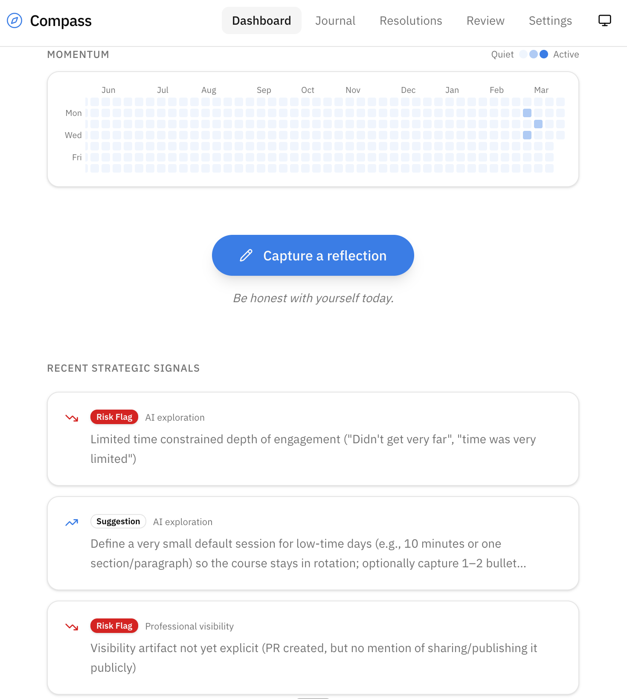

# Compass

A personal operating system for direction, momentum, and reflection.

Compass makes **important work visible over time** — without turning life into a game, a streak chase, or a productivity performance. It is not about doing more. It is about understanding what is *actually happening* and adjusting intelligently.



---

## What It Is

Compass is a self-hosted journaling and reflection tool built around a small number of high-leverage personal resolutions. You write honest, free-form reflections; the system surfaces patterns, momentum shifts, and strategic signals over time using AI.

It is not a habit tracker. It is not a task manager. It is not a goal-completion engine.

**Core beliefs:**
- Direction matters more than speed
- Momentum matters more than precision
- Reflection matters more than compliance
- Exit is a feature, not a failure

---

## Stack

- **Framework:** Next.js 16 (App Router, React 19, TypeScript)
- **Database:** PostgreSQL 16 via Docker
- **ORM:** Prisma 7 with `@prisma/adapter-pg`
- **Styling:** Tailwind CSS 4 + shadcn/ui (New York style, Lucide icons)
- **AI:** Vercel AI SDK (`@ai-sdk/anthropic`, `@ai-sdk/openai`)

---

## Getting Started

### Prerequisites

- **Node.js 24+** (see `.node-version`)
- **npm 11+**
- **Docker** (Docker Desktop must be running)

### Setup

```bash
npm run setup
```

This will:
1. Start a Docker Postgres container unique to this worktree
2. Create `.env.local` with the correct `DATABASE_URL`
3. Install npm dependencies
4. Run Prisma migrations and generate the client

Then start the dev server:

```bash
npm run dev
```

---

## Commands

| Command              | Description                              |
|----------------------|------------------------------------------|
| `npm run setup`      | Bootstrap the worktree (idempotent)      |
| `npm run dev`        | Start Next.js dev server                 |
| `npm run build`      | Production build                         |
| `npm run lint`       | Run ESLint                               |
| `npm run db:migrate` | Create/apply a new Prisma migration      |
| `npm run db:deploy`  | Apply pending migrations (no prompt)     |
| `npm run db:studio`  | Open Prisma Studio                       |
| `npm run db:reset`   | Reset database (destructive)             |
| `npm run generate`   | Regenerate Prisma client                 |
| `npm run teardown`   | Stop and remove this worktree's Postgres |

### Teardown

```bash
npm run teardown           # remove container + data
npm run teardown -- --keep # stop container but preserve data
```

---

## Further Reading

- [System philosophy](./COMPASS_PRINCIPLE.md) — the principles that govern every design decision
- [Developer guide](./AGENTS.md) — stack details, project structure, and conventions
- [System specification](./system-spec/) — full feature and data model spec
